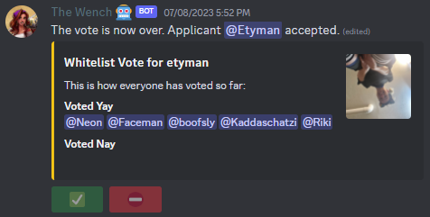

# Everneth Management Interface
**EMI** - This is an all-inclusive tool to open up commands and access to players who help run the various teams for the Everneth Survival Multiplayer community

## Commands, Permission Nodes, and General Command Usage

### MOTD System Commands
These commands are useful for providing useful information to players the moment they log into the server.

|   Command    |           Params            | Permission Node | Description                                                                                                                              |
|:------------:|:---------------------------:|:---------------:|------------------------------------------------------------------------------------------------------------------------------------------|
|  **_motd_**  |                             |  emi.motd.view  | Lets the player view all motd messages                                                                                                   |
|  **_set_**   | **\<motdTag\> \<message\>** |  emi.motd.set   | Set the tag (includes custom colors via '#') and your message. This will overrule other messages with the same tag (color doesnt matter) |
| **_delete_** |       **\<motdTag\>**       | emi.motd.delete | Delete the active motd. Do not put color codes into this command, just delete the tag letters                                            |

### Player Assistance
General for-player-use commands that allow players to interact and utilize EMI in ways to make everyone's lives 
simpler. The ability to sync and unsync Discord accounts serves the purpose of allowing members to properly utilize
EMI without the need for admin intervention in the case of a lost Minecraft or Discord account. All players are allowed
a single alternate account for use at afk farms or whatever other purposes it might aid.

 Please note that all staff members have access to an optional parameter on the discord unsync command to remove another 
player's alt from the whitelist. This is because there is a 3-day cooldown for all players to avoid spam from the constant additional and removal of
accounts from the whitelist. Staff is not restricted by this cooldown. As a staff member running this command it does not matter which account username
you input (main account or alternate), the alternate account registered for that user will be removed. For example, **Riki** has **Rikity** registered as an alt,
running `/alt remove Riki` and `/alt remove Rikity` will have the same effect of removing **Rikity** from the whitelist.

| 
Command
 |      Params      |  Permission Node   | Description                                                                                                                                   |
|:--------------------------------------:|:----------------:|:------------------:|-----------------------------------------------------------------------------------------------------------------------------------------------|
|              **_report_**              |   **\<msg\>**    |                    | Initate a report in a private channel using the JDA integrated bot                                                                            |
|             **_support_**              |   **\<msg\>**    |                    | Send a message to the `#help` channel for minor issues and questions                                                                          |
|           **_reportreply_**            |   **\<msg\>**    |                    | Reply to staff messages in an open report. Players with linked accounts will no longer receive communications                                 |
|            **_getreplies_**            |                  |                    | Get missed messages from staff while the player is offline                                                                                    |
|           **_discord sync_**           |   **\<name\>**   |                    | Link a Minecraft account with a Discord account by username. Support for old Discord usernames utilizing a discriminator (#0000) was removed. |
|          **_discord unsync_**          |                  |                    | Unlink a lost Discord account from the current Minecraft account                                                                              |
|             **_alt add_**              | **\<username\>** |                    | Add an alternate account to the whitelist for personal use                                                                                    |
|            **_alt remove_**            |  **[username]**  | emi.par.alt.remove | Removes a registered alternate account from the user that ran the command unless provided a username param by a staff member                  | 
### Charter System Commands
All commands listed here would be prefixed with 'charter' (e.g. `/charter issue <username> <# pts> [reason]`).
Additionally, commands are aliased to work as `cissue`, `chistory`, `cedit`, etc.

The charter commands are, in large part, the crux of what EMI is built for. Everneth's point-based discipline system helps ward against
recidivism and avoids an 'all or none' ban structure. These commands effectively take place of minecraft and paper's built-in ban commands.

As of EMI 2.0, all punishments for reaching every point threshold are issued out and expire automatically. Points expire after 60 days but multiple instances
of point accrual throughout that 60-day period will result in increasingly harsh punishments. All relevant information can be referenced in the charter on 
[Everneth's rules page](https://everneth.com/rules) but as a refresher the punishment structure is as follows:

1. One point accumulated, the player is issued a simple written warning.
2. Two points accumulated, the player is banned for a period of 12 hours.
3. Three points accumulated, the player is banned for a period of 24 hours.
4. Four points accumulated, the player is banned for a period of 72 hours.
5. Five points accumulated, the player is banned permanently and will have to appeal to return as a member.
    - Note there is no automated process in place for appeals, they are simply told to speak to a staff member about appealing.
   
In order to avoid targeted harassment towards staff for issuing players points, the bot also attempts to send a message to the offending player on Discord containing information such as
number of points issued, the reason the point was issued, the total number of points accrued in the last 60 days, as well as the length of any issued bans (with expiry time
included via Unix timestamp). In the event that this message cannot be sent, the issuing staff member will be notified and told to message them manually.

Editing points that were issued will re-assess a new appropriate punishment for the total point accrual and notify the user.

| 
Command
 |                      Params                      |     Permission Node     | Description                                                                                                              |
|:--------------------------------------:|:------------------------------------------------:|:-----------------------:|--------------------------------------------------------------------------------------------------------------------------|
|              **_issue_**               |       **\<player\>\<#points\>\[reason\]**        |  emi.par.charter.issue  | Issue a player points with a reason into the tracker                                                                     |
|             **_history_**              |        **\<player\> \[includeExpired\]**         | emi.par.charter.history | Lookup a players history of charter infractions. Default is to exclude expired points. Lookups are cached into JSON file |
|               **_edit_**               | **\<pointID\> \<new #points\>\[new reason\]** |  emi.par.charter.edit   | Edit a point issue record. Point ID is required for accurate record edit                                                 |
|              **_remove_**              |                 **\<pointID\>**                  | emi.par.charter.remove  | Remove a point from a players record                                                                                     |
|               **_ban_**                |            **\<player\> \[reason\]**             |   emi.par.charter.ban   | Ban a player across network                                                                                              |
|              **_pardon_**              |                  **\<player\>**                  | emi.par.charter.pardon  | Expire all active points, pardon the player, and issue 1 point as part of the process                                    |
|                **_pg_**                |                   **\<pg#\>**                    |   emi.par.charter.pg    | Cycle through pages of history results                                                                                   |

### Staff Utilities
All commands listed here are general staff utilities to make their job easier. The info command should be utilized particularly when a player has been banned to ensure that 
any alternate accounts were also banned. As of 2.1 EMI will attempt to ban both accounts on the test server as well but will notify the banning staff member if this needs to be
done manually for one or both accounts.

| 
Command
 | Params         | Permission Node | Description                                                                                                           |
|:-------------------------------------:|----------------|:---------------:|-----------------------------------------------------------------------------------------------------------------------|
|              **_info_**               | **\<player\>** |  emi.par.info   | Get a brief user information printout containing information like main account name, whitelisted alts, and Discord id |

### Application Voting and Automatic Whitelisting
Another very important part of EMI's responsibilities is the automation of the whitelisting process. Back in our forum days a lot of work went into ensuring players 
met requirements to be eligible for whitelisting, and getting staff to log into the forums to vote yay/nay could often prove difficult and untimely. As such, after 
a user has applied through Jasper (aka Gatekeeper) and hits requirements for whitelisting, EMI will start a whitelist vote automatically in the applications channel that
looks as such:

A majority vote from staff is required to approve a member for whitelisting. Half of staff voting 'Nay' will trigger a denial, as an approval is not possible in a split
decision (essentially, we are trusting that staff can come to a unanimous decision on a controversial applicant). On approval an applicant's account listed in their app
is added to the whitelist with no staff intervention required. An announcement will be made in the general chat that the user has been whitelisted.

### Discord's Built-in Slash Commands
EMI's utility is not restricted to in-game, the commands listed below are functions built directly into Discord:

`/close-report` - In the case that a report has been opened by a user and resolved you may run this command to close the channel.

`/help-clear` - When a user asks for support via the #help channel and has acknowledged their issue as resolved this command will delete all the messages except for
the very first in the channel (the root help message) and send a log of the messages to the staff room.

`/unsync` - This command is for when a player has lost access to one or both of their minecraft accounts and wishes to get a new one whitelisted. The old accounts will be
removed from the whitelist and they must run the command listed below to proceed.

`/whitelist username:` - When a player is a citizen but not synced or whitelisted they will have to request a temporary whitelisting via this command. The command will provide
instructions as to how they should proceed to get their new account synced. If the user is not synced within 5 minutes the account will be removed from the whitelist. This command
can only be run by users with the citizen role but without the synced role.

### Mint Projects
All commands listed here would be prefixed with 'mint' (e.g. `/mint project join <project name>`). 

| 
Command
 |                                    Params                                     |      Permission Node       | Description                                                                                                                           |
|:--------------------------------------:|:-----------------------------------------------------------------------------:|:--------------------------:|---------------------------------------------------------------------------------------------------------------------------------------|
|          **_project create_**          |             **\<project name\> \<project lead\> \<description\>**             |  emi.mint.project.create   | Initialy creates the project and adds you to the project                                                                              |
|           **_project join_**           |                             **\<project name\>**                              |   emi.mint.project.join    | Lets you join specific projects                                                                                                       |
|           **_project info_**           |                             **\<project name\>**                              |   emi.mint.project.info    | Lets you see basic information for the project                                                                                        |
|           **_project work_**           |                             **\<project name\>**                              |   emi.mint.project.work    | View all work needed for the project                                                                                                  |
|          **_project focus_**           |                             **\<project name\>**                              |   emi.mint.project.focus   | Sets the project as the focused project                                                                                               |
|         **_project complete_**         |                             **\<project name\>**                              | emi.mint.project.complete  | Sets the project as complete. Can't complete unless all logs have been validated                                                      |
|           **_project list_**           |                                                                               |   emi.mint.project.list    | Lists out all projects                                                                                                                |
|             **_task add_**             |                         **\<project name\> \<task\>**                         |     emi.mint.task.add      | Lets you add a task to a project                                                                                                      |
|           **_task delete_**            |                        **\<project name\> \<taskID\>**                        |    emi.mint.task.delete    | Delete any task from a project given the taskID (you can get the ID from /mint task list \<project name\>)                            |
|            **_task focus_**            |                        **\<project name\> \<taskID\>**                        |    emi.mint.task.focus     | Set the task as focused in a pjroject given the taskID (you can get the ID from /mint task list \<project name\>)                     |
|          **_task complete_**           |                        **\<project name\> \<taskID\>**                        |   emi.mint.task.complete   | Set the task as complete in a project given the taskID (you can get the ID from /mint task list \<project name\>)                     |
|            **_task list_**             |                             **\<project name\>**                              |     emi.mint.task.list     | View all tasks needed for the project and display taskID for players who have the permission                                          |
|                                        |                                                                               |    emi.mint.view.taskid    | Lets players view the taskID when using the /mint task list command                                                                   |
|           **_material add_**           |                **\<project name\>\<material\> \<amount\>**                 |   emi.mint.material.add    | Lets you add a material to a project. Material is just a string input meaning you can put whatever you want                           |
|         **_material delete_**          |                    **\<project name\> \<material name\>**                     |  emi.mint.material.delete  | Lets you delete a material given the name of the material set                                                                         |
|          **_material focus_**          |                    **\<project name\> \<material name\>**                     |  emi.mint.material.focus   | Set the material as focused in a project                                                                                              |
|        **_material complete_**         |                    **\<project name\> \<material name\>**                     | emi.mint.material.complete | Set the material as complete                                                                                                          |
|          **_material list_**           |                             **\<project name\>**                              |   emi.mint.material.list   | View all materials associated with project                                                                                            |
|           **_log material_**           | **\<project name\> \<time\> \<material name\> \<amount\> \<description\>** |        emi.mint.log        | Log material gathering done                                                                                                           |
|             **_log task_**             |               **\<project name\> \<time\> \<description\>**                |        emi.mint.log        | Log tasks or other work done                                                                                                          |
|             **_validate_**             |                             **\<project name\>**                              |     emi.mint.validate      | Lets the player grab the next log that needs to be validated. Server will send them a message to validate or to not validate the log. |
|           **_validateyes_**            |                             **\<project name\>**                              |     emi.mint.validate      | Internal command used by /mint validate                                                                                               |
|            **_validateno_**            |                             **\<project name\>**                              |     emi.mint.validate      | Internal command used by /mint validate                                                                                               |
|          **_view material_**           |                        **\<project name\> \<worker\>**                        |       emi.mint.view        | Lists all materials the player has collected for the specific project                                                                 |
|       **_view materialworkers_**       |                       **\<project name\> \<material\>**                       |       emi.mint.view        | Lists all workers that gathered specified material for the specified project                                                          |
|            **_view task_**             |                        **\<project name\> \<worker\>**                        |       emi.mint.view        | Lists all tasks the player has completed for the specified project                                                                    |

## Integrations
EMI is dependent on several libraries and service integrations. For Discord a JDA bot is implemented and delivered with the JAR. Spark handles our REST API endpoints. ACF & IDB by Aikar handle our commands and database calls.